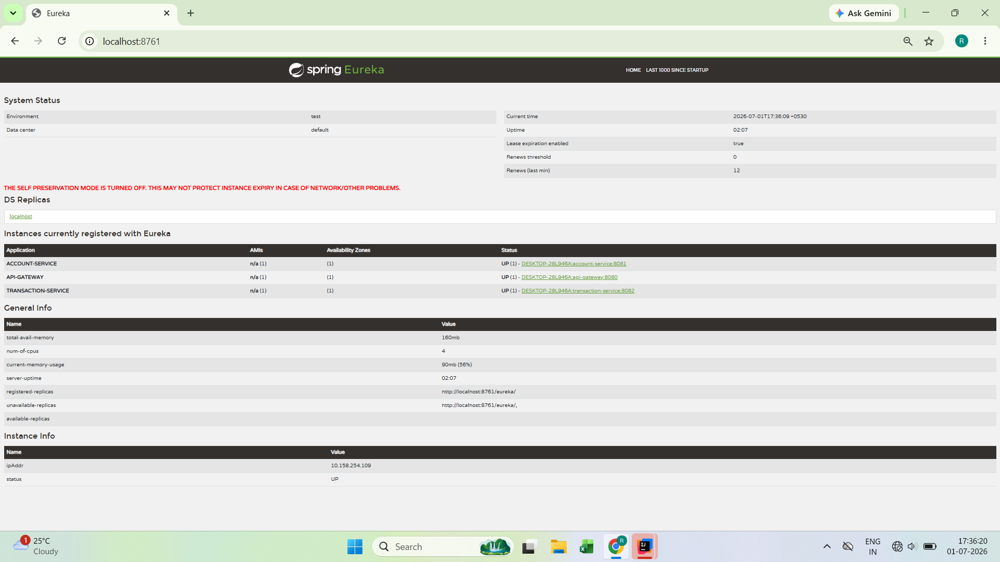
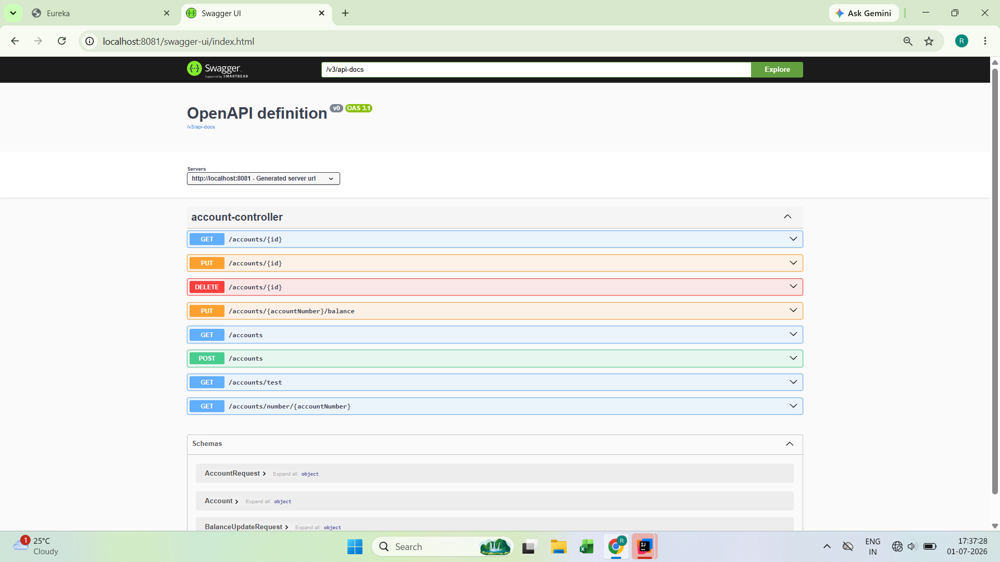
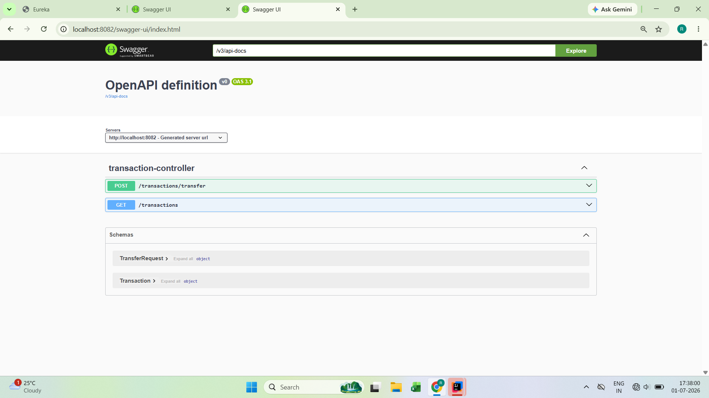
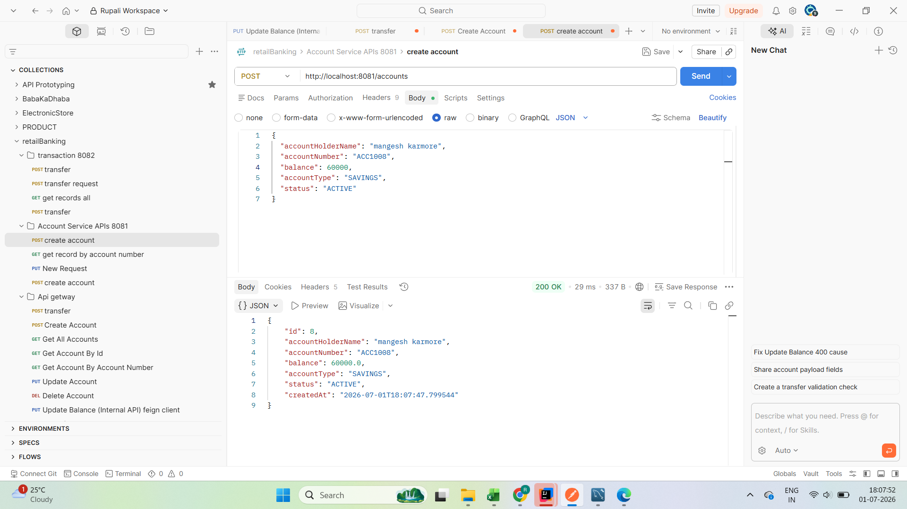
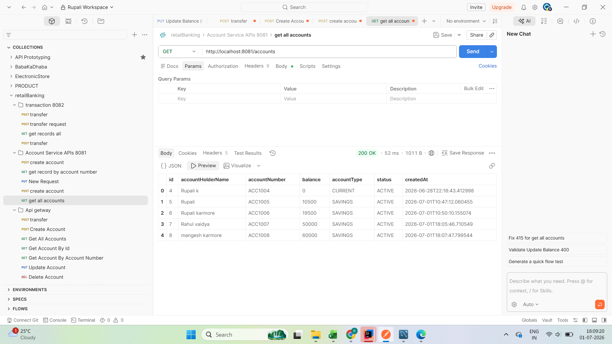
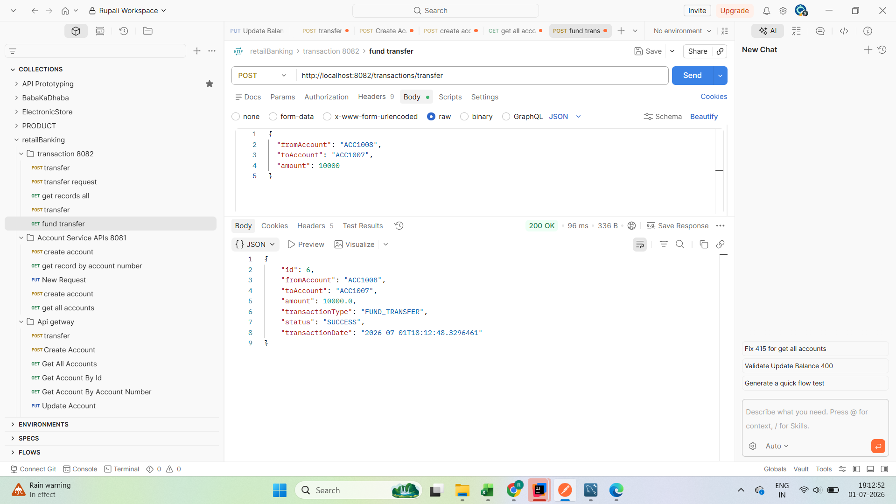
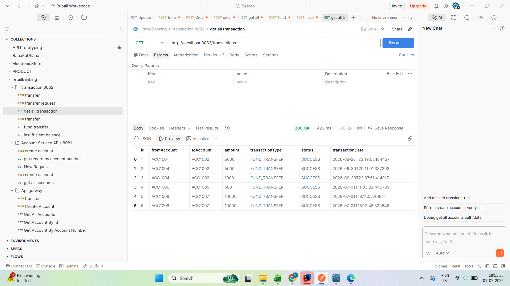
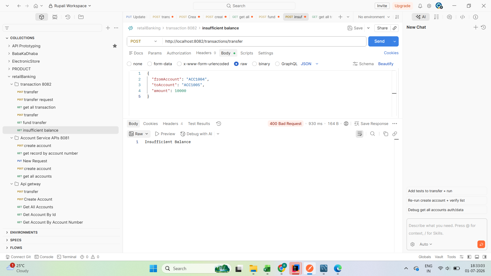
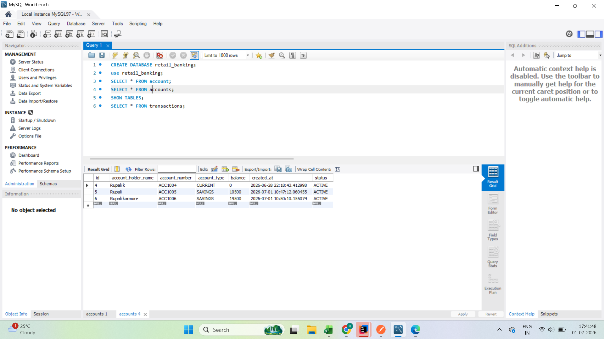
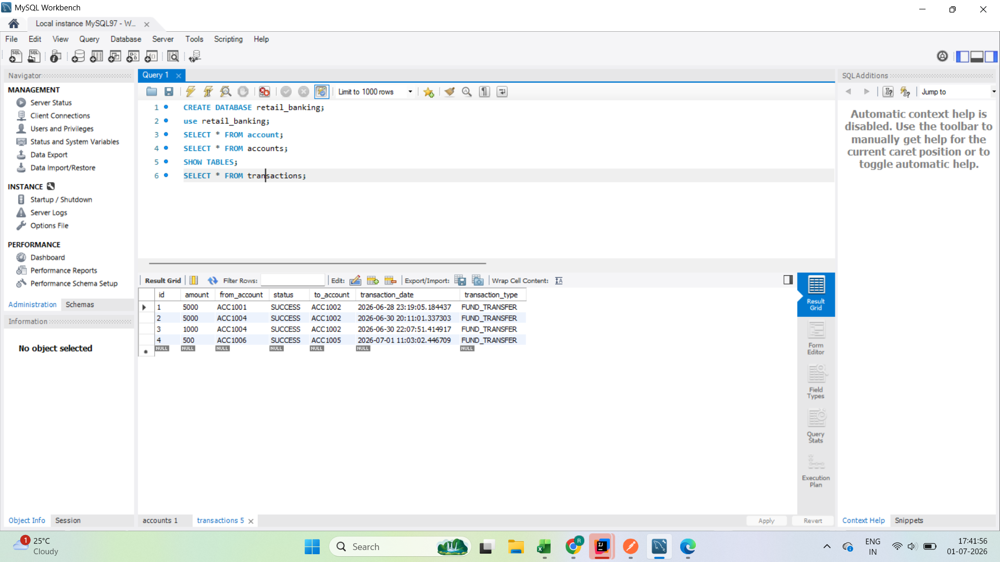

<div align="center">

# 🏦 Retail Banking System

### Spring Boot Microservices Project

A complete backend banking application developed using **Spring Boot Microservices Architecture** demonstrating service discovery, API Gateway, inter-service communication, and secure fund transfer.


---

### 🚀 Spring Boot • Spring Cloud • Eureka • API Gateway • OpenFeign • Swagger • MySQL

</div>

---

# 📖 Project Overview

Retail Banking System is a backend banking application developed using **Spring Boot Microservices**. The application is divided into multiple independent services that communicate using **OpenFeign**, while **Eureka Server** handles service discovery and **Spring Cloud Gateway** routes all client requests.

The project provides essential banking operations such as account creation, account management, fund transfer, balance validation, and transaction history. It follows a layered architecture with REST APIs and integrates MySQL for persistent data storage.

This project was built to gain hands-on experience with real-world backend development and microservices architecture.

---

# 🎯 Project Objectives

This project demonstrates the implementation of:

- Spring Boot Microservices
- RESTful APIs
- CRUD Operations
- Service Discovery using Eureka
- API Gateway Routing
- OpenFeign Communication
- Bean Validation
- Global Exception Handling
- Transaction Management using `@Transactional`
- MySQL Integration using Spring Data JPA
- API Documentation using Swagger UI

---

# ✨ Features

## 👤 Account Management

- Create Account
- Update Account Details
- Delete Account
- Get Account by ID
- Get Account by Account Number
- View All Accounts

---

## 💳 Transaction Management

- Fund Transfer
- Transaction History
- Balance Validation
- Insufficient Balance Handling
- Automatic Debit
- Automatic Credit

---

## 🌐 Microservices Features

- Eureka Service Registry
- API Gateway
- OpenFeign Client
- Independent Services
- Service Discovery
- Centralized Routing

---

## 🛡 Validation & Exception Handling

- Bean Validation
- Custom Exceptions
- Global Exception Handler
- Proper HTTP Status Codes
- Input Validation

---

# 🛠 Tech Stack

| Category | Technology |
|-----------|------------|
| Language | Java 17 |
| Framework | Spring Boot 3 |
| Architecture | Microservices |
| ORM | Spring Data JPA |
| Database | MySQL |
| Build Tool | Maven |
| Service Discovery | Eureka Server |
| API Gateway | Spring Cloud Gateway |
| Communication | OpenFeign |
| Documentation | Swagger / OpenAPI |
| Validation | Jakarta Validation |
| API Testing | Postman |
| Version Control | Git |
| Repository | GitHub |

---

# 🏗 High-Level Architecture

```text
                    Client
                       │
                       ▼
               API Gateway (8080)
                       │
          ┌────────────┴────────────┐
          ▼                         ▼
 Account Service             Transaction Service
      (8081)                      (8082)
          │                         │
          └────────────┬────────────┘
                       ▼
             Eureka Server (8761)
                       │
                       ▼
                     MySQL
```

---

# 📌 Services Used

| Service | Port |
|----------|------|
| Eureka Server | 8761 |
| API Gateway | 8080 |
| Account Service | 8081 |
| Transaction Service | 8082 |

---

# 📂 Project Structure

```
Retail-Banking-System
│
├── account-service
│   ├── controller
│   ├── dto
│   ├── entity
│   ├── exception
│   ├── repository
│   ├── service
│   └── resources
│
├── transaction-service
│   ├── controller
│   ├── dto
│   ├── entity
│   ├── exception
│   ├── feign
│   ├── repository
│   ├── service
│   └── resources
│
├── api-gateway
│
├── service-registry
│
├── database
│   └── retail_banking.sql
│
├── postman
│   └── retailBanking.postman_collection.json
│
├── screenshots
│
└── README.md
```

---

# 📦 Microservices Description

## 1️⃣ Service Registry (Eureka Server)

**Port : 8761**

Responsible for registering all microservices and enabling service discovery.

### Responsibilities

- Service Registration
- Service Discovery
- Monitoring Registered Services

---

## 2️⃣ API Gateway

**Port : 8080**

Acts as a single entry point for all client requests.

### Responsibilities

- Route Requests
- Hide Internal Service URLs
- Centralized Request Handling

---

## 3️⃣ Account Service

**Port : 8081**

Responsible for all account-related operations.

### Functionalities

- Create Account
- Update Account
- Delete Account
- Get Account Details
- Get Account By Account Number
- Update Account Balance

---

## 4️⃣ Transaction Service

**Port : 8082**

Responsible for fund transfer and transaction history.

### Functionalities

- Fund Transfer
- Transaction History
- Debit Sender Account
- Credit Receiver Account
- Balance Validation
- Save Transaction Details

---

# 🔄 Fund Transfer Flow

```
User

      │

      ▼

POST /transactions/transfer

      │

      ▼

API Gateway

      │

      ▼

Transaction Service

      │

      ▼

OpenFeign Client

      │

      ▼

Account Service

      │

      ▼

Validate Sender Balance

      │

 ┌────┴────┐

 │         │

 ▼         ▼

Enough    Not Enough

 │           │

 ▼           ▼

Debit      Throw Exception

 │

 ▼

Credit Receiver

 │

 ▼

Save Transaction

 │

 ▼

Return Success Response
```

---

# ⚙️ Prerequisites

Before running this project, make sure the following software is installed.

- Java 17
- Maven
- MySQL 8+
- Git
- Postman
- STS / IntelliJ IDEA

---

# 🚀 Getting Started

## Clone Repository

```bash
git clone https://github.com/rupali-v/Retail-Banking-System.git
```

Move into the project folder.

```bash
cd Retail-Banking-System
```

---

# 🗄 Database Setup

Create a MySQL database.

```sql
CREATE DATABASE retail_banking;
```

Import the SQL file located inside:

```
database/retail_banking.sql
```

---

# ▶️ Run the Services

Start the applications in the following order:

1. Service Registry
2. API Gateway
3. Account Service
4. Transaction Service

---

# 🌐 Verify Running Services

| Service | URL |
|----------|-----|
| Eureka Dashboard | http://localhost:8761 |
| API Gateway | http://localhost:8080 |
| Account Service | http://localhost:8081 |
| Transaction Service | http://localhost:8082 |

---

# 📡 REST API Documentation

The project exposes RESTful APIs for account management and fund transfer operations.

---

# 🏦 Account Service APIs

### ➜ Create Account

| Method | Endpoint |
|----------|----------------|
| POST | `/accounts` |

### Request Body

```json
{
  "accountHolderName": "Rupali",
  "accountNumber": "ACC1005",
  "balance": 10000,
  "accountType": "SAVINGS",
  "status": "ACTIVE"
}
```

### Success Response

```json
{
  "id": 5,
  "accountHolderName": "Rupali",
  "accountNumber": "ACC1005",
  "balance": 10000,
  "accountType": "SAVINGS",
  "status": "ACTIVE"
}
```

---

## ➜ Get All Accounts

| Method | Endpoint |
|----------|----------------|
| GET | `/accounts` |

---

## ➜ Get Account By ID

| Method | Endpoint |
|----------|----------------|
| GET | `/accounts/{id}` |

Example

```
GET /accounts/5
```

---

## ➜ Update Account

| Method | Endpoint |
|----------|----------------|
| PUT | `/accounts/{id}` |

---

## ➜ Delete Account

| Method | Endpoint |
|----------|----------------|
| DELETE | `/accounts/{id}` |

---

## ➜ Update Account Balance

| Method | Endpoint |
|----------|----------------|
| PUT | `/accounts/{accountNumber}/balance` |

Example

```
PUT /accounts/ACC1005/balance
```

---

# 💳 Transaction Service APIs

## ➜ Fund Transfer

| Method | Endpoint |
|----------|--------------------------|
| POST | `/transactions/transfer` |

### Request Body

```json
{
  "fromAccount": "ACC1006",
  "toAccount": "ACC1005",
  "amount": 500
}
```

### Success Response

```json
{
  "id": 4,
  "fromAccount": "ACC1006",
  "toAccount": "ACC1005",
  "amount": 500,
  "transactionType": "FUND_TRANSFER",
  "status": "SUCCESS"
}
```

---

## ➜ Transaction History

| Method | Endpoint |
|----------|----------------|
| GET | `/transactions` |

---

# ⚠ Error Handling

The project handles different exceptions using **Global Exception Handler**.

Examples:

### Account Not Found

```
404 NOT FOUND
```

Response

```json
{
  "message": "Account not found."
}
```

---

### Insufficient Balance

```
400 BAD REQUEST
```

Response

```json
{
  "message": "Insufficient Balance"
}
```

---

### Validation Error

```
400 BAD REQUEST
```

Example

```json
{
  "amount": "Amount must be greater than zero"
}
```

---

# 📘 Swagger Documentation

Swagger UI is available for API testing.

### Account Service

```
http://localhost:8081/swagger-ui/index.html
```

### Transaction Service

```
http://localhost:8082/swagger-ui/index.html
```

The project uses Swagger/OpenAPI for interactive API documentation and testing.

---

# 📸 Project Screenshots

The following screenshots demonstrate the successful execution of the application.

---

## 🛰 Eureka Dashboard

Shows all registered microservices.



---

## 📘 Account Service - Swagger UI

REST API documentation for Account Service.



---

## 📘 Transaction Service - Swagger UI

REST API documentation for Transaction Service.



---

## 👤 Create Account

Successfully created a new bank account.



---

## 📋 Get All Accounts

Displays all available bank accounts.



---

## 💸 Successful Fund Transfer

Successful money transfer between two accounts.



---

## 📜 Transaction History

Displays all completed transactions.



---

## ⚠ Insufficient Balance Validation

Shows proper validation when sender account has insufficient balance.



---

## 🗄 MySQL - Accounts Table

Account records stored in the database.



---

## 🗄 MySQL - Transactions Table

Transaction records stored in the database.



---

# 📮 Postman Collection

The complete Postman collection is available inside the project.

```
postman/
└── retailBanking.postman_collection.json
```

All APIs can be tested by importing this collection into Postman.

---

# 🗄 Database

The SQL script required to create the database and insert sample records is available here:

```
database/
└── retail_banking.sql
```

Database Used:

- MySQL 8+

---

# ⚠ Challenges Faced During Development

## 1. Service Discovery

### Problem

Initially, the microservices were unable to discover each other.

### Solution

Configured Eureka Server and registered all microservices successfully.

---

## 2. Inter-Service Communication

### Problem

Transaction Service was unable to communicate with Account Service.

### Solution

Implemented OpenFeign Client for service-to-service communication.

---

## 3. API Gateway Routing

### Problem

Requests were not reaching the target microservice.

### Solution

Configured Spring Cloud Gateway routes properly.

---

## 4. Insufficient Balance Validation

### Problem

Money transfer was allowed even when the sender had insufficient balance.

### Solution

Added balance validation and created a custom `InsufficientBalanceException`.

---

## 5. Exception Handling

### Problem

Unhandled exceptions were returning internal server errors.

### Solution

Implemented a Global Exception Handler using `@RestControllerAdvice`.

---

## 6. Transaction Management

### Problem

During fund transfer, data consistency needed to be maintained.

### Solution

Used `@Transactional` to ensure atomic transactions.

---

# 📚 Key Learnings

This project helped me gain hands-on experience with:

- Spring Boot Microservices
- REST API Development
- Spring Data JPA
- OpenFeign Client
- Eureka Service Discovery
- Spring Cloud Gateway
- Swagger / OpenAPI
- MySQL Integration
- Bean Validation
- Global Exception Handling
- Transaction Management
- Git & GitHub
- Maven Project Management

---
# 🚀 Future Enhancements

The following features can be added to make the project more production-ready:

- 🔐 Spring Security with JWT Authentication
- 🐳 Docker Containerization
- ☸ Kubernetes Deployment
- ⚡ Spring Cloud Config Server
- 🔄 Resilience4j Circuit Breaker
- 📩 Apache Kafka / RabbitMQ Integration
- 📦 Redis Caching
- 📊 Zipkin Distributed Tracing
- 📈 Monitoring using Spring Boot Actuator
- 🧪 Unit Testing with JUnit & Mockito
- 🔄 CI/CD Pipeline using GitHub Actions or Jenkins

---

# 💼 Skills Demonstrated

This project demonstrates practical knowledge of:

### Backend Development

- Java 17
- Object-Oriented Programming
- Spring Boot
- Spring MVC
- RESTful Web Services

### Database

- MySQL
- Spring Data JPA
- Hibernate
- CRUD Operations

### Microservices

- Spring Cloud
- Eureka Server
- API Gateway
- OpenFeign
- Service Discovery

### API Development

- REST APIs
- Request Validation
- Exception Handling
- Swagger Documentation

### Tools & Version Control

- Maven
- Git
- GitHub
- Postman

---

# 🎯 Project Highlights

✔ Developed using **Microservices Architecture**

✔ Implemented **Service Discovery using Eureka**

✔ Configured **Spring Cloud Gateway**

✔ Integrated **OpenFeign Client** for service-to-service communication

✔ Implemented secure **Fund Transfer Workflow**

✔ Added **Bean Validation**

✔ Implemented **Global Exception Handling**

✔ Used **@Transactional** for transaction consistency

✔ Documented APIs using **Swagger UI**

✔ Tested APIs using **Postman**

✔ Managed project using **Git & GitHub**

---

# 📖 Learning Outcomes

While building this project, I gained hands-on experience in:

- Designing Microservices Architecture
- Developing REST APIs
- Inter-service Communication
- Spring Data JPA
- Database Design
- API Gateway Routing
- Service Registration & Discovery
- Exception Handling
- Transaction Management
- Git Workflow
- API Testing
- Professional Project Documentation

---

# 👩‍💻 Developed By

## Rupali Karmore

**Java Backend Developer**

### Tech Stack

Java • Spring Boot • Spring Cloud • Microservices • MySQL • Hibernate • Spring Data JPA • OpenFeign • Eureka • API Gateway • Swagger • Maven • Git • GitHub

---

# 🙏 Acknowledgements

This project was developed as part of my learning journey in **Java Backend Development** and **Spring Boot Microservices** to gain practical experience in building enterprise-level applications.

---

# ⭐ If you found this project useful

Please consider giving this repository a **Star ⭐** on GitHub.

It helps and motivates me to build more projects.

---

<div align="center">

## ❤️ Thank You for Visiting My Repository

**Happy Coding! 🚀**

</div>
